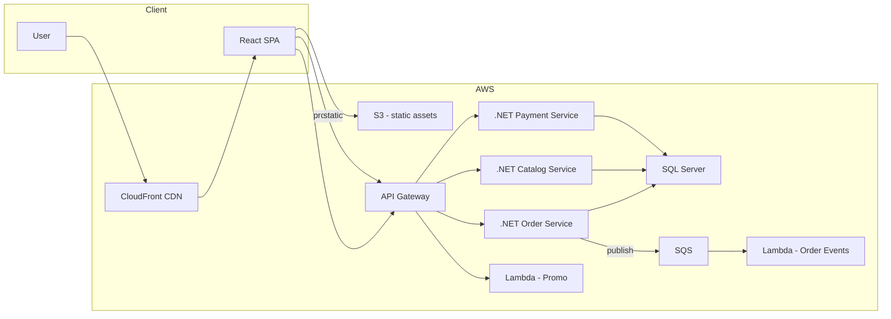
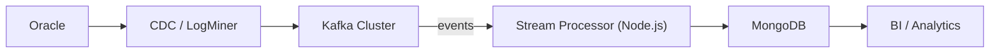
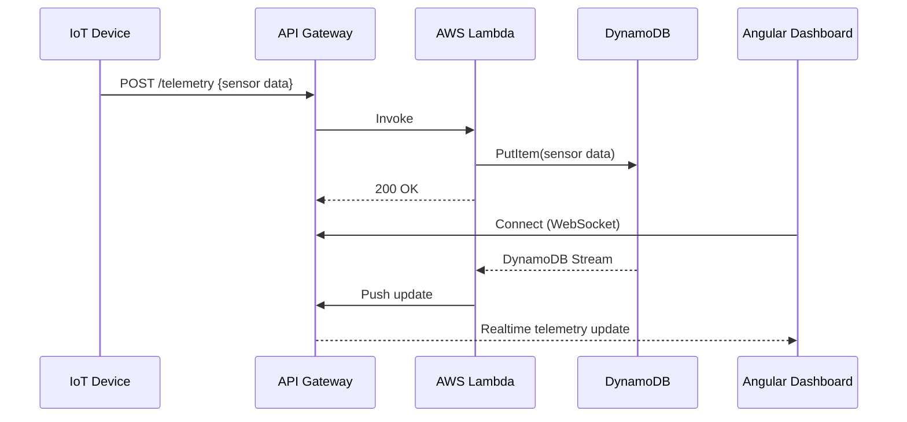

# 💻 Tom McDonald (aka **bodyrock**)  
**Solution Architect | Full Stack | Cloud | Databases**

---

## 🚀 About Me  
I’m a Solution Architect with 20+ years of experience designing and delivering scalable systems across **frontend, backend, and cloud**.  

My expertise spans:  
- **Frontend**: React, Angular  
- **Backend**: .NET Core, Node.js  
- **Cloud**: AWS (Lambda, API Gateway, S3, DynamoDB)  
- **Databases**: SQL Server, Oracle, MongoDB  

I focus on building secure, high-performing solutions that integrate complex systems and deliver measurable business value.  

---

## 🛠️ Core Skills  
- **Frontend**: React, Angular, TypeScript, JavaScript  
- **Backend**: .NET Core, Node.js, RESTful APIs, GraphQL  
- **Cloud**: AWS Lambda, API Gateway, S3, CI/CD pipelines  
- **Data**: SQL Server, Oracle, MongoDB, data integration & migration  
- **Architecture**: Microservices, Event-driven design, Cloud-native solutions  

---

## 📂 Pinned Projects (Case Studies)

### 🔹 **E-Commerce Modernization Platform**  
*Tech: React, .NET Core, SQL Server, AWS Lambda*  
- Designed a cloud-native architecture for a retail platform handling 10K+ daily transactions.  
- Built microservices for order management, integrated with payment providers, and modernized frontend UI with React.  
- Implemented AWS Lambda functions to scale peak shopping season traffic.  

**How to Run (Demo Setup)**  
```bash
# clone sample frontend
git clone https://github.com/bodyrock/ecommerce-frontend-demo
cd ecommerce-frontend-demo
npm install
npm start

# backend API (dotnet core)
git clone https://github.com/bodyrock/ecommerce-api-demo
cd ecommerce-api-demo
dotnet run
```

### Architecture Diagram


Tech: Node.js, Oracle, MongoDB, Kafka

Architected a real-time data sync between legacy Oracle systems and MongoDB for analytics.

Used Kafka for event streaming and ensured high availability with cluster failover.

Delivered faster insights to business users with a unified data view.

How to Run (Demo Setup)

```
# start kafka + zookeeper
docker-compose up -d zookeeper kafka

# run node.js data sync service
git clone https://github.com/bodyrock/data-integration-demo
cd data-integration-demo
npm install
npm start
```


🔹 IoT Monitoring Dashboard

Tech: Angular, AWS API Gateway, DynamoDB

Designed a monitoring dashboard for thousands of IoT devices.

Built APIs to aggregate sensor data and visualize it in real-time Angular dashboards.

Leveraged AWS serverless stack (API Gateway + Lambda + DynamoDB) for cost-efficient scaling.

How to Run (Demo Setup)
```
# spin up local angular app
git clone https://github.com/bodyrock/iot-dashboard-demo
cd iot-dashboard-demo
npm install
ng serve

# deploy mock lambda function locally
sam local invoke "TelemetryHandler" -e events/telemetry.json
```


📈 Current Focus

Modernizing legacy apps into cloud-native architectures

Designing full stack solutions that balance scalability & maintainability

Exploring AI-assisted development workflows

🌐 Connect With Me

💼 LinkedIn

🌍 Website / Portfolio

✉️ Email


